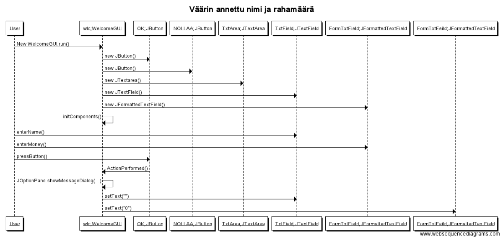
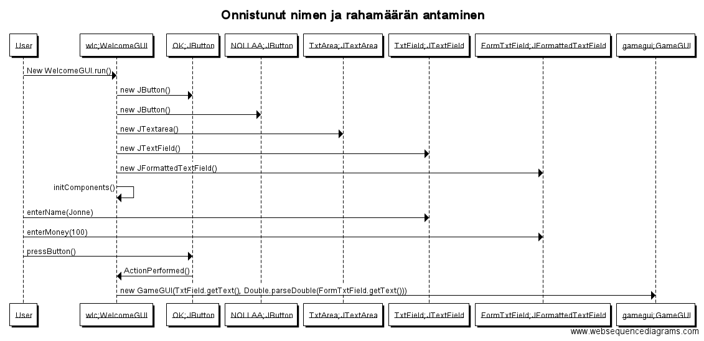
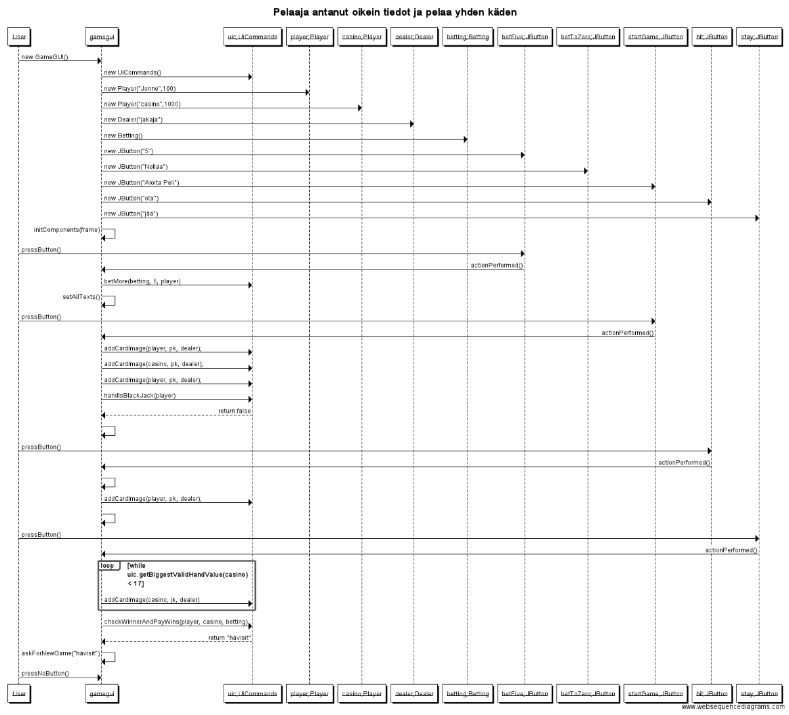

Aihe
====
 Toteuttaa Blackjack-peli (https://en.wikipedia.org/wiki/Blackjack).
Tarkoituksena on aluksi toteuttaa ohjelma, jossa samanaikaisesti voi pelata vain
jakajaa (talo) vastaan. Perusominaisuudet panostus, tuplaus, vakuutus, ota kortti
Kun peli toimii halutulla tavalla, voi sitä jatkokehittää lisäämällä bonuspelejä,
pelipaikkoja.

Rakenne
-------
- Blackjack.data paketissa on 4 luokkaa: Card, Deck, Player, Hand. Näitä luokkia käytetään ylläpitämässä tietoa pelistä ja pelin etenemiseen.
- Blackjack.logiikka paketissa on 2 luokkaa: Betting ja dealer. Betting luokassa käsitellään pelaajan panosta ja dealer luokka on vastuussa
  korttien jakamisesta pelaajalle ja talolle.
- Blackjack.guilogiikka paketissa on 3 luokkaa: UicBetting, UicDealing ja UicConclusion. UicBetting on vastuussa lähinnä graafisen käyttöliittymän
  panostamiseen liittyvien painikkeiden toiminnasta. UicDealing on vastuussa pelin korttien jakamiseen liittyvien painikkeiden toiminnasta.
  UicConclusion on vastuussa pelin päättymisestä ja sen mukaisen tilan hallinnoimisesta.
- Blackjack.ui pkaetissa on 2 luokkaa: GameGUI ja WelcomeGUI. WelcomeGUI on ensimmäinen näkymä, jonka käyttäjä näkee. Sillä ei ole yhteyksiä
  muuhun kuin GameGUI. GameGUI on tärkein luokka ja se sisältää tarvittavat komponentit pelin pelaamiseen ja se käyttää blackjack.guilogiikka
  paketin luokkien metodeja pelin läpivientiin.

Sekvenssikaavioita
------------------

